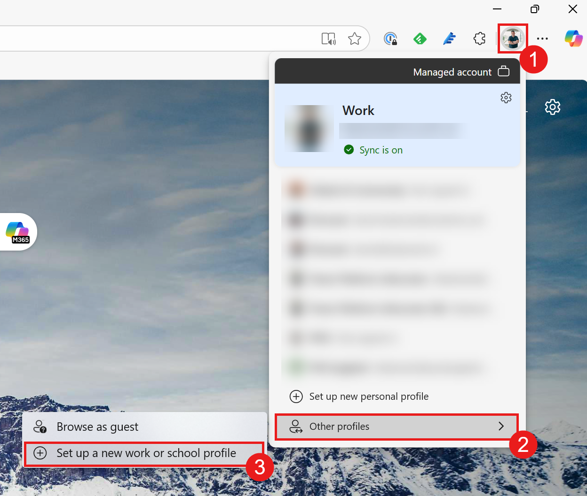
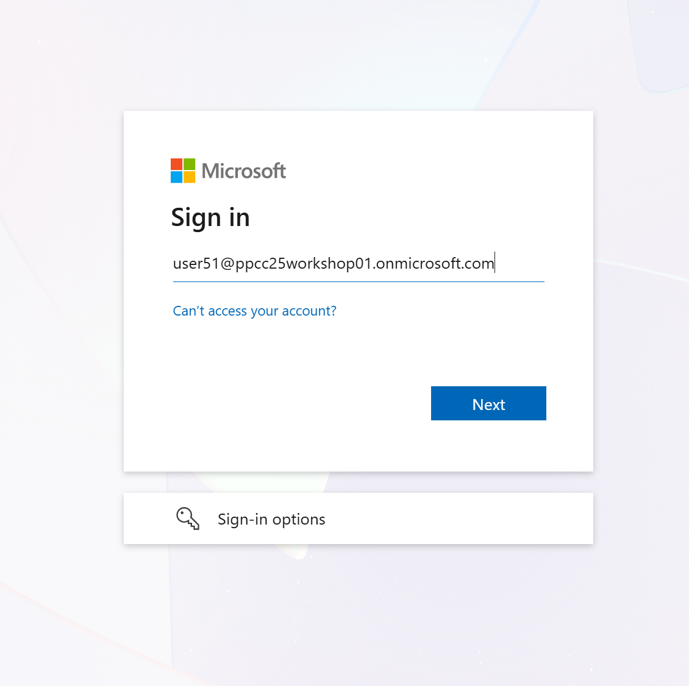
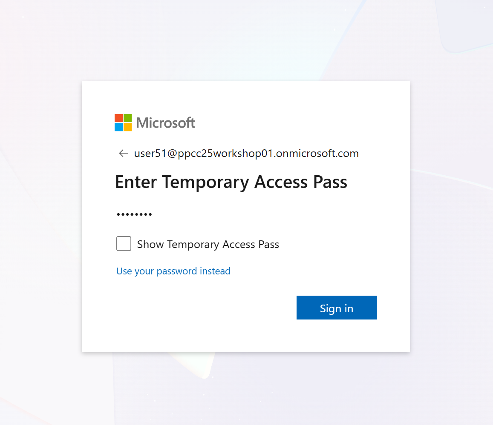
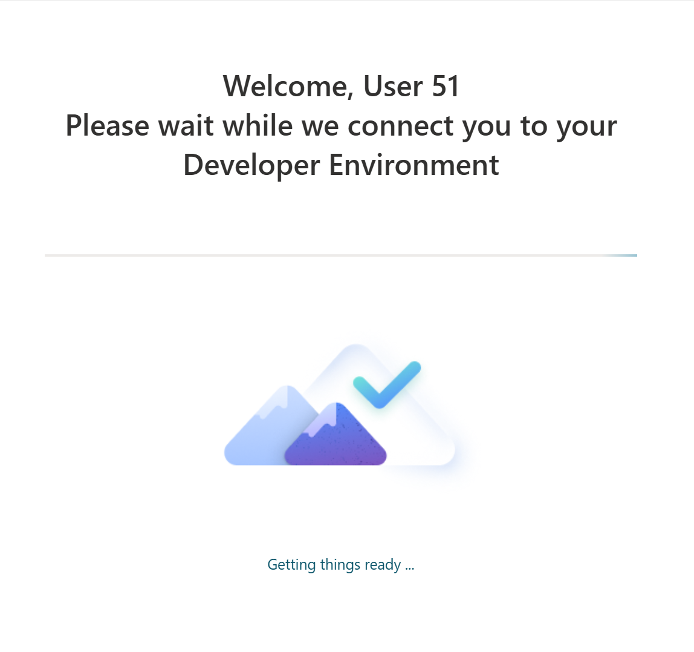
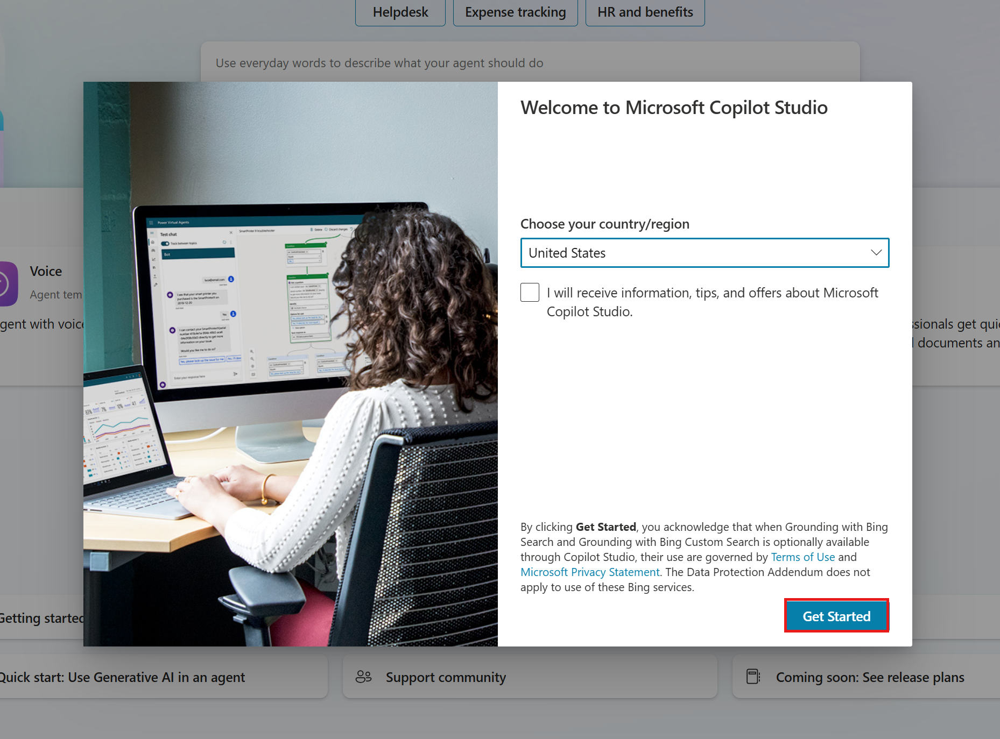
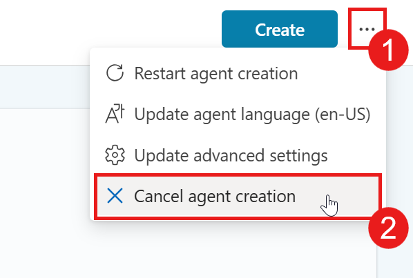
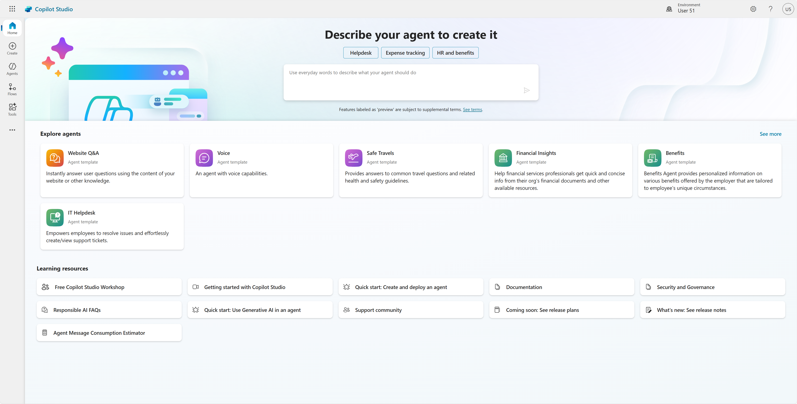

# Lab 01: Setup

Before we can get started with the other labs, we need to make sure we have everything installed. The following prerequisites are needed to ensure a successful workshop.

In this lab, you will go through the following tasks:

* Install required development tools (Microsoft Edge, Python, VS Code, Git, DevTunnels)
* Log into the lab environment

## ✅ Prerequisites

This lab requires several tools and resources to be installed on your local development environment. Each tool serves a specific purpose in the Copilot Studio extensibility workflow:

* **Microsoft Edge**: Browser for testing and accessing Copilot Studio
* **Python (LTS)**: Runtime environment for building custom connectors and extensions
* **VS Code**: Primary code editor for development work
* **DevTunnels**: Tool for creating secure tunnels to expose local services for testing

**Note:** If you already have any of these tools installed on your machine, you can skip their installation and proceed to the next tool. Make sure your existing installations are up to date.

## 💻 Installing Required Resources

### Microsoft Edge

Microsoft Edge comes pre-installed on Windows 10 and 11. If you need to install or update it:

* Download from [microsoft.com/edge](https://www.microsoft.com/edge)
* Run the installer and follow the prompts
* Edge will auto-update in the background

### Python (LTS)

To install Python Long-Term Support version:

1. Visit [python.org/downloads](https://www.python.org/downloads/)
1. Download the latest stable version (currently Python 3.12.x is recommended)
1. Run the installer and **check "Add Python to PATH"**

### VS Code

To install Visual Studio Code:

1. Download from [code.visualstudio.com](https://code.visualstudio.com/)
1. Run the installer
1. Recommended: Check "Add to PATH" during installation

### DevTunnels

To install DevTunnels CLI:

1. Install via winget:

   ```powershell
   winget install Microsoft.devtunnel
   ```

1. Or download manually and add to PATH

## 🔐 Log into the lab environment

For this workshop - we will hand out accounts which you can use. This account is already prepped for us and will have an environment for you on which you can run these labs.

### Create a new browser profile (Microsoft Edge)

It's always good to have a separate browser profile for your work and for workshops like this. This way you can keep all of your credentials separate and not have to worry about logging out of your personal / work accounts.

1. Open Microsoft Edge
1. Click on the profile icon on the top left corner
1. Hover over "Other Microsoft Edge Browsers" / "Other profiles" and then select **Add Browser** / **Add profile**

   

   This will then open up a new browser window on your taskbar.

1. Pin that browser window to your taskbar
1. In the new browser window, select **Start without your data**

   

1. Then select **Confirm and start browsing**.

   

   It may prompt you to configure your new browser theme. If this happens, just select **Next** and then **Finish**.

### Log on to your account

With the credentials that were provided to you, let's log into the account you are going to use during the workshop.

1. Go to [copilotstudio.microsoft.com](https://copilotstudio.microsoft.com)
1. On the sign-in screen, enter the email address that has been provided to you and then click **Next**

   

1. Then enter the Temporary Access Pass that has been provided to you and click **Sign in**

   

1. If you're prompted to stay signed in, click **Yes**
1. Select **Yes** when being asked if you want to be signed in

    This will trigger the creation of your developer environment. The following loading screen will show:

    

1. When that's done, select **Get Started**

    

1. In the _Welcome to Copilot Studio_ screen select **Skip**

    

1. Select **...** on the top-right corner next to the _Create_ button and then select **Cancel agent creation**

    

1. Select **Yes, continue**

    This will forward you to the Copilot Studio homepage.

    

This is it for the first module! Piece of cake, right? 😊
