# Lab 03 - Building a Custom Connector from Scratch and add it to your agent 💪

In this lab, you will go through the following tasks:

* Create a solution
* Create a connector in the solution
* Setup authentication
* Add operation with Parameters

We will use the community event API as an example to connect to. You will later need to use an API key, for this workshop you can use the demo API Key **f785f5baf4f0470e809bdf097b994f62**, write it down for later.

## 🏗️ Create a solution

Best Practice for everything in the Power Platform: Work INSIDE solutions. They are great for organizing your customizations and some features only work here plus they over ALM capabilities (remember from last lab?).

Because of that our first step within **[make.powerapps.com](https://make.apps.com)** is to navigate to **Solutions** on the left hand side and click on **New Solution**

In the dialog which open give your solution a meaningful name and select either create an own publisher by clicking **New** or use the **Default Publisher** named after your environment.

> [!NOTE]
> Using the Default Publisher is not considered best practice because you have no control about the technical prefix all your components will receive. 

Congrats you have a solution for doing our Custom Connector development! Every journey starts with the first step 💪

## 🔗 Create a connector from blank

As we learned before there are multiple ways to create a Custom Connector, we will use the most basic one to learn the basics 🙂

Inside your solution click on **New** and in the menu on **Automation** and then on **Custom Connector**

### General Definition

In a new tab the Custom Connector edit wizard will be opened in the first step.

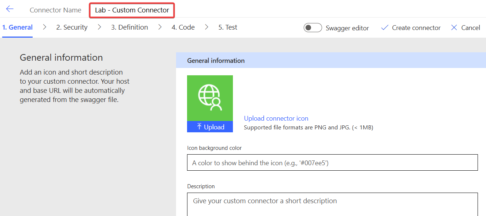

First step is given your Custom Connector a meaningful name, make sure to use a name your users will understand, this will show up in all UIs. Bonus points if you also add an icon below under **General Information**

Next you need to select **HTTPS** and fill in the **Host** and **Base URL**. The community event API can be reached via dhino (Middleware used to publish Dataverse data) under the following url. Do not fill the "https://" part in the host and you can only put the root URL until the first "/" there. The "Base URL" is the part of the URL which is common to all requests being done via this custom connector.

**<https://apim-dhino-fetch-prod-002.azure-api.net/002 >**

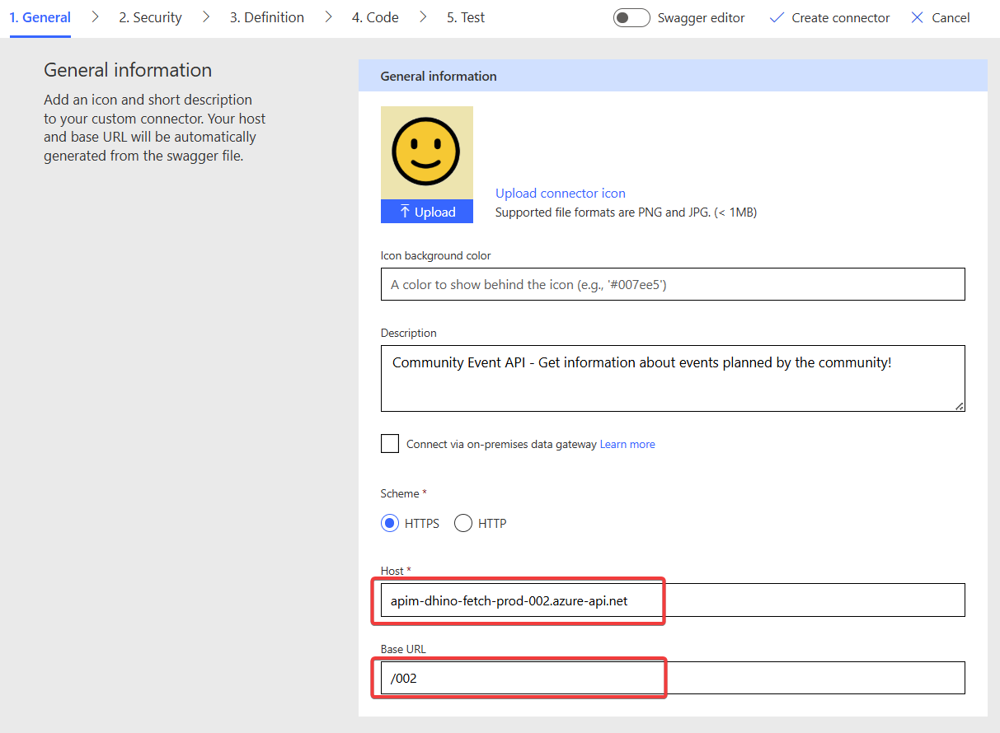

## 🔐 Define Security / Authentication

Click on **Security** on the bottom or in the wizard status on top to move on to the next step. Authentication describes how the Custom Connector will authenticate with the API and the options to choose from depends on the used API.

For the Event API the authentication is done via an **API Key**, so select this option

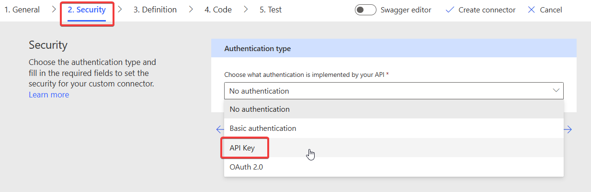

After selecting you will asked to enter the label, name and location of parameter.

**Label:** This will be shown to the user when creating a new connection, shows a readable meaningful name

**Name:** This is the technical defined **by the API** so you can be creative here!

**Location:** This defines where the Custom Connector will add the API Key information when making requests.

The Community Event API will be authenticated by an API Key in the Header of each HTTP Request called **Ocp-Apim-Subscription-Key**

All done! Very important: **You do not need to enter any API Key in this step!** Authentication info is never stored directly in a Custom Connector but only ever in Connections. They will get created later when we are actually are using our Custom Connector.

## ⚡ Create first simple definition

Click on **Definition** to get to the next step of creating a Custom Connector, the stage where we define the actual actions which are possible to execute for this Custom Connector.

In this screen you see all actions, triggers, references and policies you have added to your connector. Since we create from Blank this screen will be empty.

Let's change that by adding our very first action by clicking on **New Action**

Creating an action consists of three steps:

* Naming / Description
* Request definition
* Response definition

### Naming / Description

As a minimum you need to enter a unique id for this action. Choose a name which is easily recognizable and not a typical "id" because later on other actions use this id to refer to it.

We want to call the Community Event API to get a list of all available events, which we can call it with a **GET** request to this url:
**<https://apim-dhino-fetch-prod-002.azure-api.net/002/export/query/FF4740ED-7415-4D36-80A7-7E7C565806AA/974BB697-57A4-4132-8A6E-C6E11BCE5493/EVENTS>**

The two GUIDs in the URL are referencing the environment we want to target and we will consider them static for now, they point to the community database in our community tenant.

### Request

Pick an id for this operation and we will go on the **Request** part of it.

The wizard has a great feature called **Import from Example** where you can copy paste an existing request (for example from documentation or lab instructions on GitHub), an the wizard will extract all needed information.

In the opened dialog fill in the URL and HTTP method from above. Since this is a simple request with no further information you are all set to go and can click **Import**

Congrats, your connector has its first action! 🥳 Let's quickly test if we did all steps correctly so far.

### Saving and Testing

In order to test a Custom Connector you always have to save it first. If it's the first time it will actually create the Custom Connector. Do this by clicking **Create Connector**. This will deploy all resources needed in the backend and can sometimes take a bit.

After the Creating is done and the loading screen is gone we can skip ahead in the Wizard navigation and jump to the final stage **Test**

Because the connector is newly created there is no Connection yet so in order to test it we first need to create one by clicking on **New Connection**

This will open a new tab where you have the default Create New Connection interface like for all connectors. Which fields are shown is dependent on the selected authentication method. In our case this is the API key. Recognize the name of this field? That's the label we defined in the **Security** step! Click **Create Connection** to create it. Use the API Key  **f785f5baf4f0470e809bdf097b994f62** for this.

You will be redirect to the test screen. If the **Connection** field is still empty, click on the **Refresh** button and your newly created connection shows up.

With that we are ready to test! On the left hand you can select the action, and since we only have one which has no parameter you can click directly on **Test**

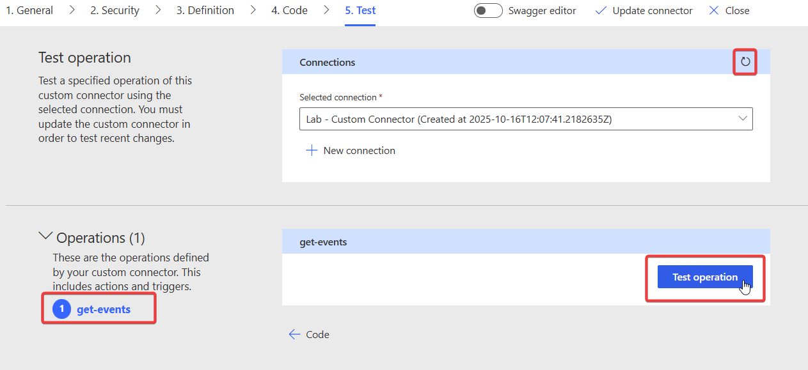

If all is set up correct and the connection has the right API Key you will see the result of that API call with a HTTP status 200.

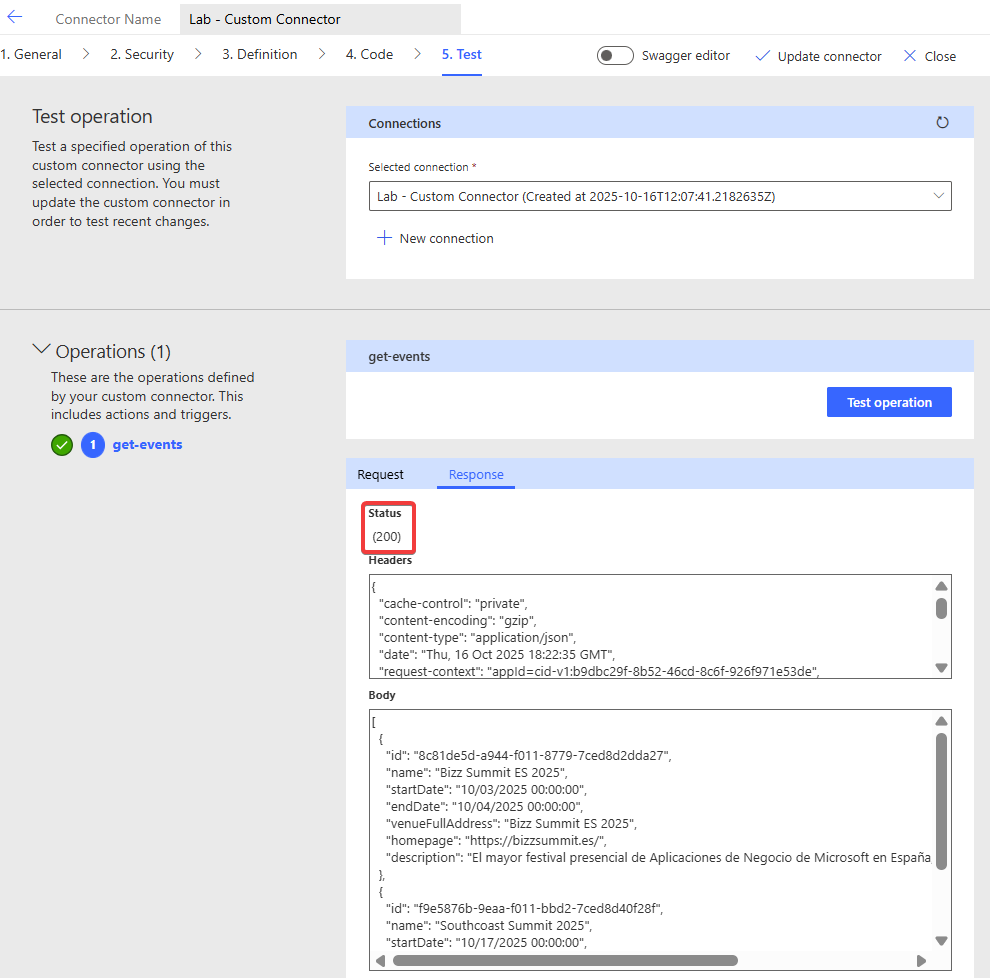

First call made by your Custom Connector to the Community Event API!

We will do one more step though, as you might noticed we skip one step in the definition part, the definition of the **Result** of our operation. Since we now have the result JSON let's add it!

### Result of operation

Copy the body from your test execution of the operation.

Afterwards we navigate back to **Definition** of the wizard. Here navigate down to the **Response** area and click on **Add Default Response**

This will open again a dialog where you can define the expected result by copying a demo result. Good that we have one now! We only care about the body of this result for this API so copy the response into the **Body** field. The Dialog will now parse the JSON Object and store its schema (similar to the **Parse JSON** action in Power Automate!)

To see the result click on the **Default Response** in the main screen.

In the detail screen we now see that the Custom Connector knows about all the fields which are returned from the action.

This is very important and **strongly** recommended to set up for all your actions. If you don't this, when a user calls this action in any UI (Power Automate, Power Apps, etc.) they will only get a JSON object and have to do all parsing themselves. This way the structure is already stored in the Custom Connector and can be directly used. This will be important in the following steps.

Also remember to **Update Connector** to publish your changes!

## 🎯 Create an operation with parameter

Let's get into the more interesting stuff, let's make more dynamic operations. You saw that the GET/Events action only returned one event because the environment has this global filter, so let's check out the connected records. For this we will add **Tracks** and **Sessions** with the goal of getting only session of a certain track.

For that we will need the Tracks first so let's start with them!

### GET/Tracks

Follow the same steps as we did in the operation, starting on the **Definition** screen and click on **New Action**

The action is again a GET call to the following URL **<https://apim-dhino-fetch-prod-002.azure-api.net/002/export/query/FF4740ED-7415-4D36-80A7-7E7C565806AA/974BB697-57A4-4132-8A6E-C6E11BCE5493/TRACKS>**

After following the same steps as we did for the GET/EVENTS, you should see a test result like this:

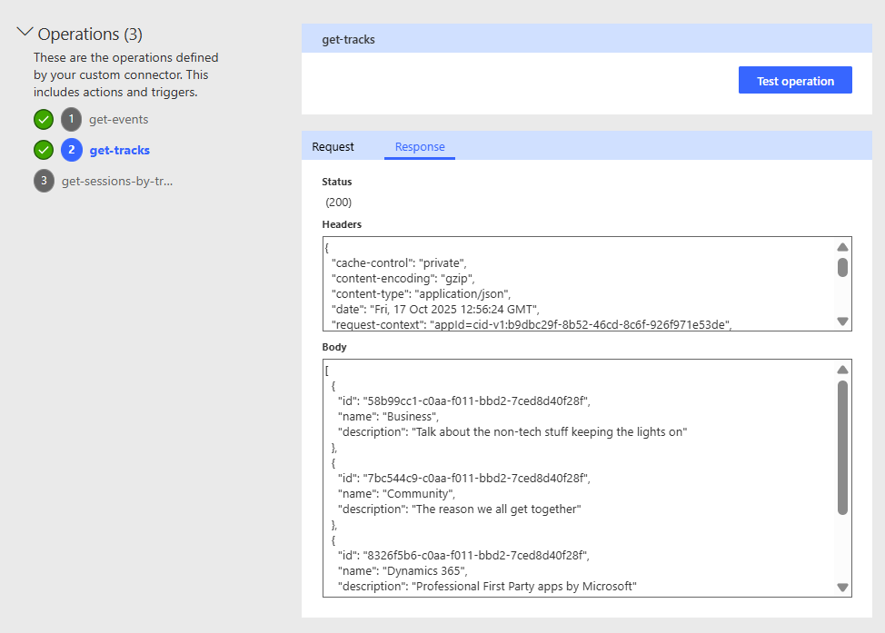

Like we did before copy these and add them as the **Default Response** in the definition screen for the Tracks action. If you click on the Default Action afterwards the properties should be parsed like this:

Tip: Make sure to select the correct action on the left hand side before Import the Default Response, or you might risking overwriting the response of the first action.

### GET/Session By Track

Next step is calling the action which returns us sessions filtered by track. The Community Event API offers the following GET endpoint, here as an example for the track **Power Platform**:

**<https://apim-dhino-fetch-prod-002.azure-api.net/002/export/query/FF4740ED-7415-4D36-80A7-7E7C565806AA/974BB697-57A4-4132-8A6E-C6E11BCE5493/SESSIONSBYTRACK?filter=2653cbaf-c0aa-f011-bbd2-7ced8d40f28f>**

This is the endpoint for track **Dynamics 365**:

**<https://apim-dhino-fetch-prod-002.azure-api.net/002/export/query/FF4740ED-7415-4D36-80A7-7E7C565806AA/974BB697-57A4-4132-8A6E-C6E11BCE5493/SESSIONSBYTRACK?filter=8326f5b6-c0aa-f011-bbd2-7ced8d40f28f>**

The dynamic part of this request is the part after the "?filter=" followed by the **Id** of a track.

So our first step is adding an action which takes one parameter. For that we go to **Definition** and add another action, give it an id, and use the **Import From Sample** function.

Copy the URL from above, but this we modify the URL and mark which part should be a parameter. This is done by replacing the text with "{PARAMETERNAME}", so if we want to add a parameter named "trackid" we use the following URL:

**<https://apim-dhino-fetch-prod-002.azure-api.net/002/export/query/FF4740ED-7415-4D36-80A7-7E7C565806AA/974BB697-57A4-4132-8A6E-C6E11BCE5493/SESSIONSBYTRACK?filter={trackid}>**

After clicking on **Import** you directly see that our request now has a parameter:

If you click on the parameter and select **Edit** you can check it's properties. We have a lot of options here, for now let's just set it to **Required = Yes** because without a value the API will error out.

After this let's test our new function! **Update Connector** and move to the **Test** screen and select the new action. You see that we now have a parameter field and can add an Id for a track. Test the Tracks action first to get the ids and then test it with the new action.

This works pretty well! But obviously this not an ideal user experience, you need to know very cryptic GUIDs and there is no support on how to enter them. Let's improve that in the next step!

## 🚀 Making an action dynamic
In the previous step we added an action with a parameter but noticed the usability was subpar. One way to improve is to replace the manual input field with **Dynamic Values** which are a drop-drown which is not hardcoded but instead uses value from another action.

Basically, we want to achieve this when someone uses this action:
- Make a call to the **Tracks** action to get available Tracks
- Instead of their Id display a readable Description or Name
- When making the call to the SessionByTrack API send the id instead of the displayed Name.

Let's build this! 🙂

We start back on the **Definition** page, select the SessionByTrack action and open the parameter:

On the detail page we will take a more detailed look at the dropdown types. With these we can change the field from manual input to a dropdown from which a user can easily select a value.

The following options are available

- **Disabled**  Default value, no dropdown, just manual input
- **Static** Dropdown, values must hardcoded in the custom connector. No way to differentiate between id and displayname

- **Dynamic** Dropdown, but this time the values are provided during runtime by another action 👍

We will use the **Dynamic** option in this case.
- Select our GET/Tracks action as **Operation Id** (that's why operation id names are important!)
- The **Value** can be picked from the field we defined as the default response in the GET/Tracks action. If there is no response defined, this feature can not be used! In this case we use the **id** property of the Track because the API is requiring this value.
- The **Value Display Name** will be the field which is only used for the user to make it easier to pick the right value. In our case we use the **Name** property of the Track

Awesome let's **Update Connector** and go to our Test page!

## 🪄 Testing in Power Automate
Power Automate, more specifically Power Automate Cloud Flows is probably the tool using Custom Connectors the most. In order to create our test flow, navigate to your solution (remember the best practice: Everything inside solutions!), by selecting **Solutions** on the left hand side and opening your created solution from before in this lab.

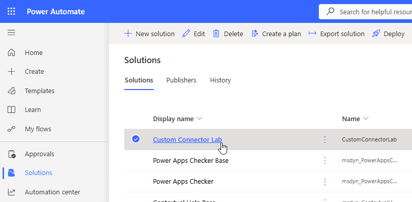

In your solution you should already see your connector 🙂 (sometimes the UI takes a bit to refresh)

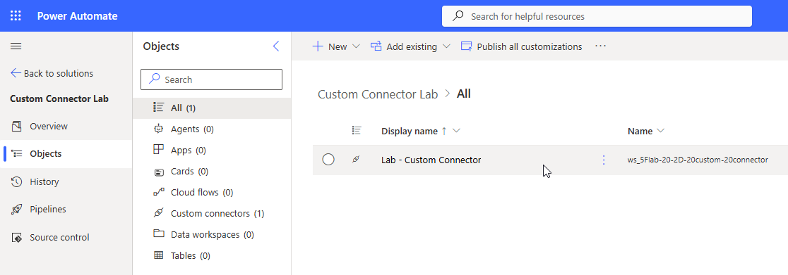

We are going to add a new **Manuel Flow** by clicking on **New** -> **Automation** -> **Cloud Flow** -> **Manual**

Manual means that the flow can be trigger manually via the UI which is usually the easiest for testing and debugging.

In the creation wizard give the Flow a meaningful name and make sure the trigger **Manually trigger a flow**

 

### Building the Flow

Within our Flow editor we want to add a **New Step**

Here you find all available connectors. On the tab **Custom** is our newly created Custom Connector. Here is also a great example why images for custom connectors are important, it helps **a lot** with the discoverability, especially if you have many!

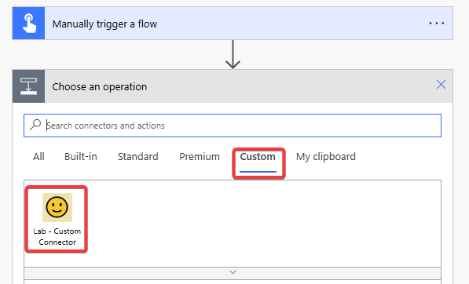

After selecting our Custom Connector we see all available actions we did define in it. Select our GET/SessionsByTrack action.

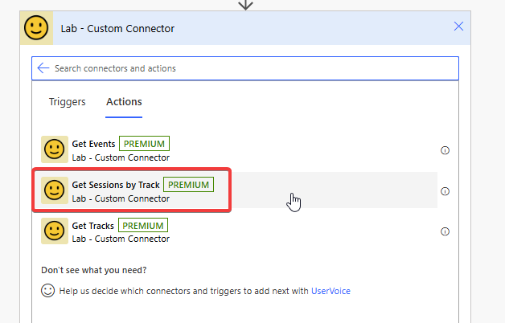

The first time you use a Custom Connector in Power Automate you must create a new connection for security reasons. You can choose any name and reuse the API Key from before.

After we created the connection we do see our parameter field, but this time it is displayed as a dropdown!

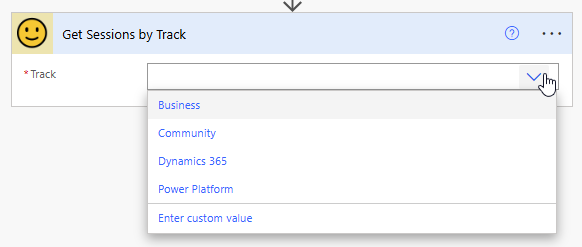

Notice that the values are displayed by their name and not the id even if the API is requiring the id. Let's **Save** our Flow and then do a **Test**.

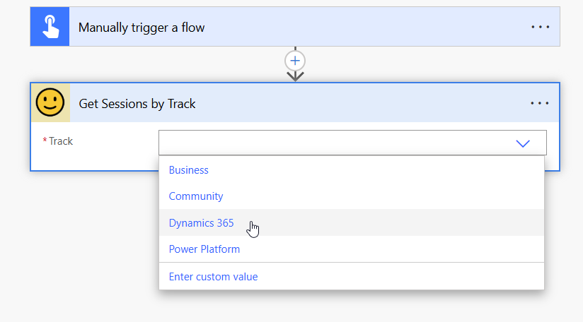

In the Test dialog select **Manually** and then **Run Flow**. If you work with input or automatic trigger the **Automatically** option is powerful because you can easily restart the flow with previous inputs. But for now we are going with Manually.

After confirming that you want to run the flow you can close the dialog and will see the results within the editor. You can click on single actions to inspect their in- and outputs.

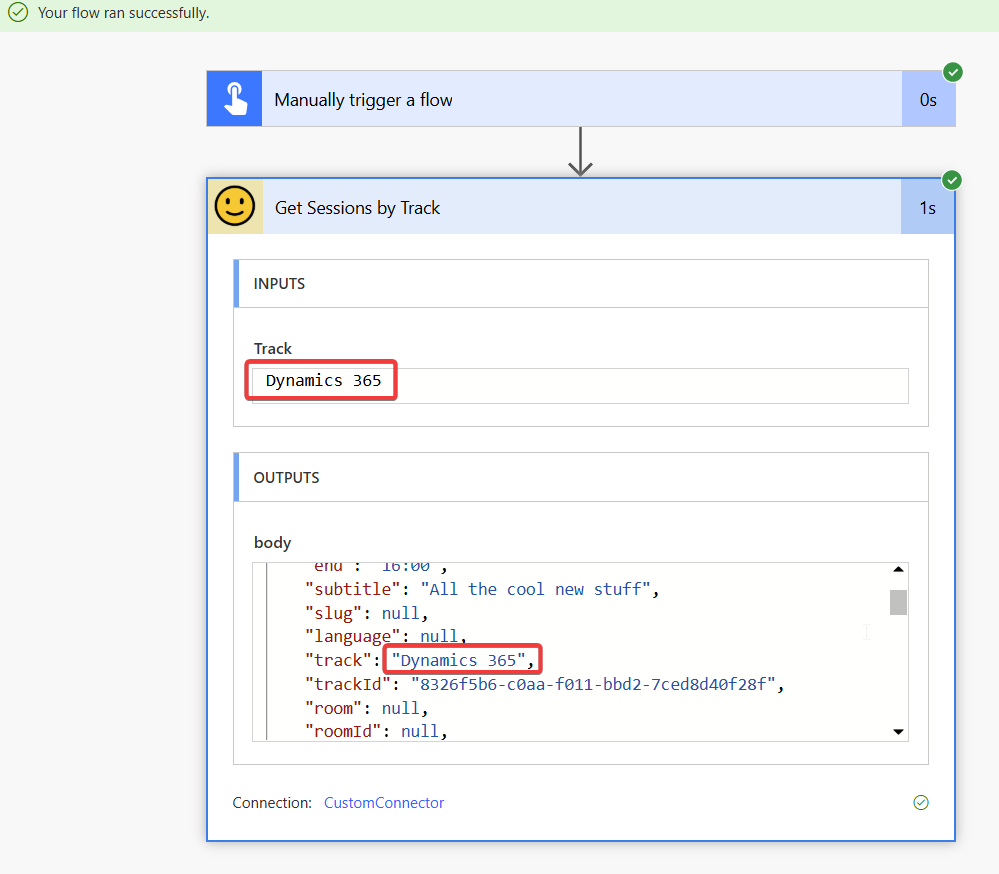

Because we defined the Reponses of all our actions it's also pretty easy to combine them. For example we can use the GET/Tracks action to get an array of all tracks and then iterate through them to get all sessions per track.

For this we add the GET/Tracks action above our GET/SessionsByTrack action and want to use it's output in it. For this you have to select **Enter Custom Value** in the dynamics dropdown to dynamically fill this value (🤪)

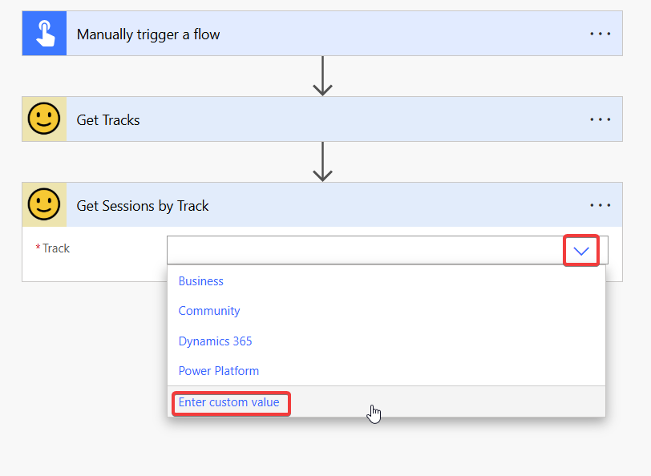

And because we defined the response properties of our GET/Tracks action we can now select them nicely in the UI.

And the Custom Connector also knows that GET/Tracks returns an array, so it automatically wraps the action in an **Apply to Each**

## 🔥 Increase the UX with user-friendly names
One thing you could quickly tell was that our clear **operation ids** are not very user friendly in these kinds of UIs. But the great thing is that we can actually do something about this and within the Custom Connector add more information. For this we will go back to our Custom Connector, edit it, and go to definitions to update our Actions.

First we will create more detailed descriptions of the actions themselves. With these you can give your action friendly names and also provide additional explanations which will be displayed as extended texts or tooltips. And of course these descriptions are immensely  important for any AI you want to use your Custom Connector with.

You can do the same with parameters or response properties if you go into the edit mode of those. You can also control the **Visibility** to either hide or promote actions.

Visibility in Power Automate will be displayed like this

So by taking care of these properties, you make your connectors a lot easier to use and more professionally looking. But at the same time, you also prepare them for AI 🙂

## 💯 Adding the Custom Connector to your agent

Now let's navigate back to Copilot Studio to add our Custom Connector to an agent. In Copilot Studio click on **Tools** and **Add Tool**

Select **Connector** and search for your connector name, you will see all the actions you defined before!

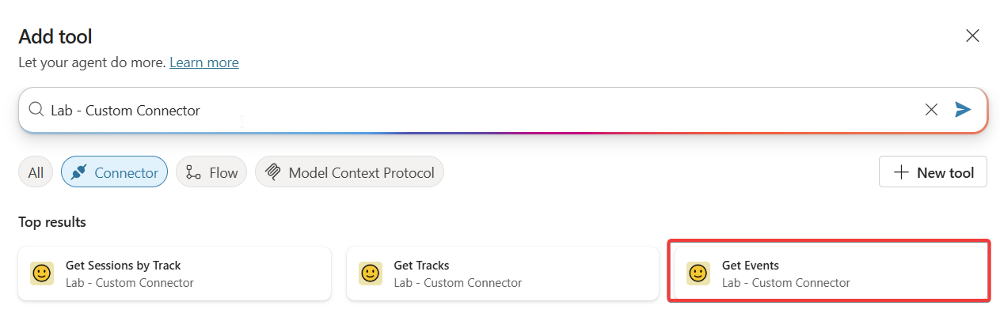

You can add multiple Actions as tools, do this and test your agent with the Custom connector!
