# Lab 04: Setup an API Key protected MCP Server locally and add it to Microsoft Copilot Studio

In this part, you will learn about how to run a Model Context Protocol (MCP) server and how to connect it to Microsoft Copilot Studio. Zava has created an MCP server for inventory management that provides tools for managing products (like `get_products` and `add_product`), stores (such as `get_stores` and `add_store`), and inventory operations (including `list_inventory_by_store`).

The MCP server is available via the following link: [download MCP server](https://raw.githubusercontent.com/microsoft/scs25-copilot-studio-extensibility/refs/heads/main/src/ZavaInventoryMCP.zip)

Make sure to unpack the folder on your machine and copy the folder to the C-drive, so that you have the MCP server available here: **C:\ZavaInventoryMCP**.

## 📂 Open the MCP Server in Visual Studio Code

1. Open Visual Studio Code by selecting Visual Studio Code in the taskbar
1. Select **File > Open Folder**
1. Navigate to **C:\ZavaInventoryMCP**
1. Select **Select Folder**
1. You might see a pop up where you will be asked to trust the authors of the files in this folder. Make sure to select **Yes, I trust the authors**

    

This will open the Zava Inventory Management MCP server in Visual Studio Code. Let's explore the MCP Server to see what files are in there.

## 🔍 Explore the Zava Inventory Management MCP Server

The MCP server folder contains several key files that make up the MCP Server:

### Source files

Expand the **src** folder in the **Explorer** section on the left hand side and browse the source files.

- **src/server.py**: The main MCP server implementation with all tools for products, stores, and inventory
- **src/helpers.py**: Utility functions for data loading and JSON file operations
- **src/middleware.py**: Authentication middleware for API key validation
- **src/requirements.txt**: Python dependencies needed to run the server

### Data files

Expand the **Data** folder to see what's in this folder.

- **data/products.json**: Sample product data with products
- **data/stores.json**: Sample store data with store locations
- **data/inventory.json**: Sample inventory records with stock entries

Make sure to look around in these files to see what's going on in the server. Now, let's install the dependencies so that we can run the server locally.

## 📦 Install dependencies

1. Open the terminal by selecting **Terminal > New Terminal**
1. Make sure you are in the following folder: **C:\ZavaInventoryMCP**
1. Create a new virtual environment by running the following command (press **Enter** after pasting in the terminal to run it):

    ```bash
    python -m venv .venv
    ```

1. Now, you need to activate the virtual environment. Run the following command to do that.

    ```bash
    .venv\Scripts\activate
    ```

1. Install all dependencies by running the command below. It might take a while, so wait a little while until it's finished.

    ```bash
    pip install -r src/requirements.txt
    ```

## ▶️ Run the MCP Server

1. Now it's time to run the MCP Server. Use the following command to start the Zava Inventory MCP Server.

    ```bash
    python src/server.py
    ```

After running the MCP Server, you're not there yet. The MCP Server is only running locally right now, so you need to make sure the MCP Server is available through a public URL. This is a requirement for Microsoft Copilot Studio. Because it's a cloud service, it's not able to reach your localhost.

## 🌐 Configure a dev tunnel

To make sure we can reach the MCP Server from Microsoft Copilot Studio, we'll add a dev tunnel. During these steps, you will be prompted to log in. Use the Entra ID account from this workshop when you are prompted to log in.

> [!Note] A dev tunnel creates a secure connection that exposes your local development server to the internet through a public URL. This allows cloud services like Copilot Studio to access your locally running MCP server.

In the terminal at the bottom of Visual Studio Code, we are going to configure a dev tunnel.

1. Select the **+** in the top right corner of the terminal

    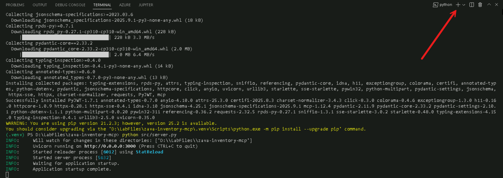

    This will open a new terminal, so that we don't stop our running server.

1. Run the following command to login to the dev tunnel service

    ```bash
    devtunnel login
    ```

1. In the pop-up that will appear, select **Work or School account** and select **Continue**
1. Log in with the account we gave you before
1. In the next screen where it asks if you want to automatically sign into all desktop apps on this device, select **No, this app only**

    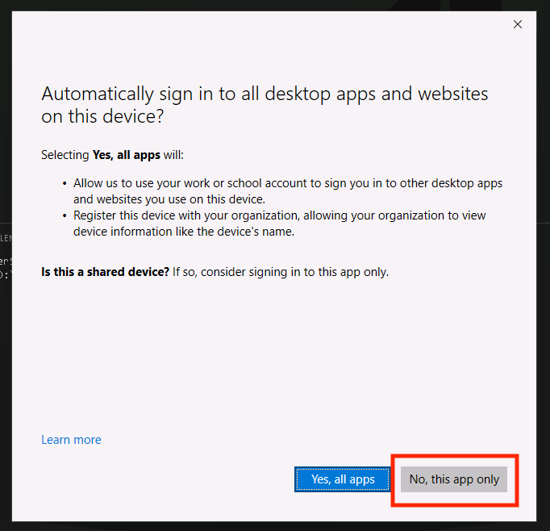

1. Run the following command to create the devtunnel:

    ```bash
    devtunnel create -a
    ```

1. Run the following command to open port 3000 for the dev tunnel:

    ```bash
    devtunnel port create -p 3000
    ```

<!-- markdownlint-disable-next-line MD033 -->
1. Run the following command to host the dev tunnel:

    ```bash
    devtunnel host
    ```

    This will give you the following message:  

    <!-- markdownlint-disable-next-line MD033 -->
    Connect via browser: <https://x.devtunnels.ms:3000>, <https://x-3000.x.devtunnels.ms>
    <!-- markdownlint-disable-next-line MD033 -->
    Inspect network activity: <https://x-3000-inspect.x.devtunnels.ms>
    Ready to accept connections for tunnel: x.x

    <!-- markdownlint-disable-next-line MD033 -->
    > [!WARNING]
    > It's very important to select the URL that looks like this: <https://x-3000.x.devtunnels.ms>
    >
    > The other URL - with *:3000* at the end of the URL - will give you errors later on.

1. Open the second URL after connect via browser by using **ctrl + click**

    Now your browser will be opened and you will see a warning like this:

    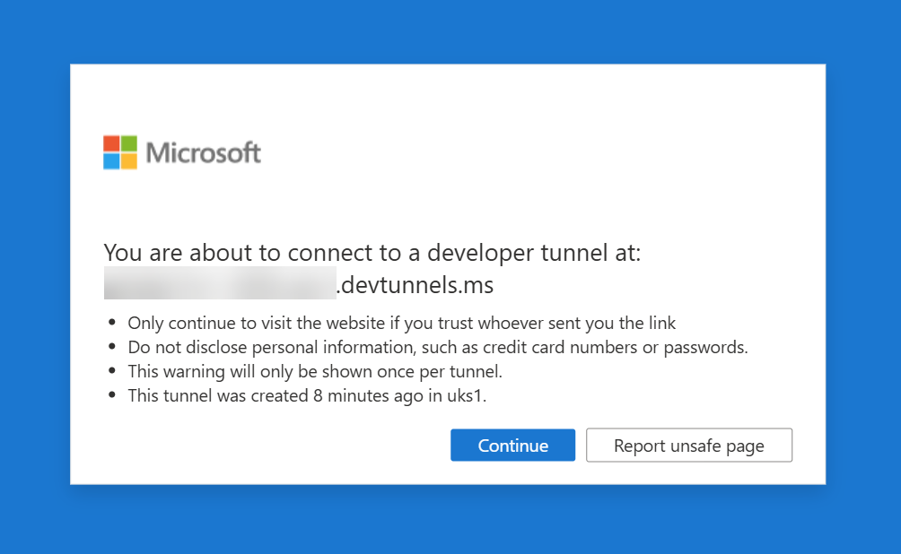

1. Select **Continue**

    Now, the following message should be displayed:  

    The Zava Inventory 📦 MCP Server 🧠 is running

1. In the address bar, add `/mcp` behind the address and hit **Enter**

    Now your browser will display an error, because in the browser we didn't add the API Key.  
    🔒 Authentication Failed ⛔

We are going to fix this error in the next steps.

## 🔗 Add the MCP Server in Microsoft Copilot Studio

1. Open your browser and go back to the environment where you create the agent earlier
1. Open your agent
1. In the top navigation, select **Tools**
1. Select **+ Add a tool**
1. Select **+ New tool**
1. Select **Model Context Protocol**
1. Enter the **Name**:

    ```text
    Zava Inventory MCP
    ```

1. Enter the **Description**:

    ```text
    MCP server that provides tools for managing Zava's product inventory, store locations, and stock operations across multiple retail locations.
    ```

1. Enter the **Server URL**. This should be the URL you opened earlier during the devtunnel steps without the *https://* in front of it and with the */mcp* behind it. For example: *x-3000.x.devtunnels.ms/mcp*.
1. For *Authentication*, select **API key**
1. Leave the *type* on *Header* and for *Header name* add the following value:

    ```text
    authorization
    ```

    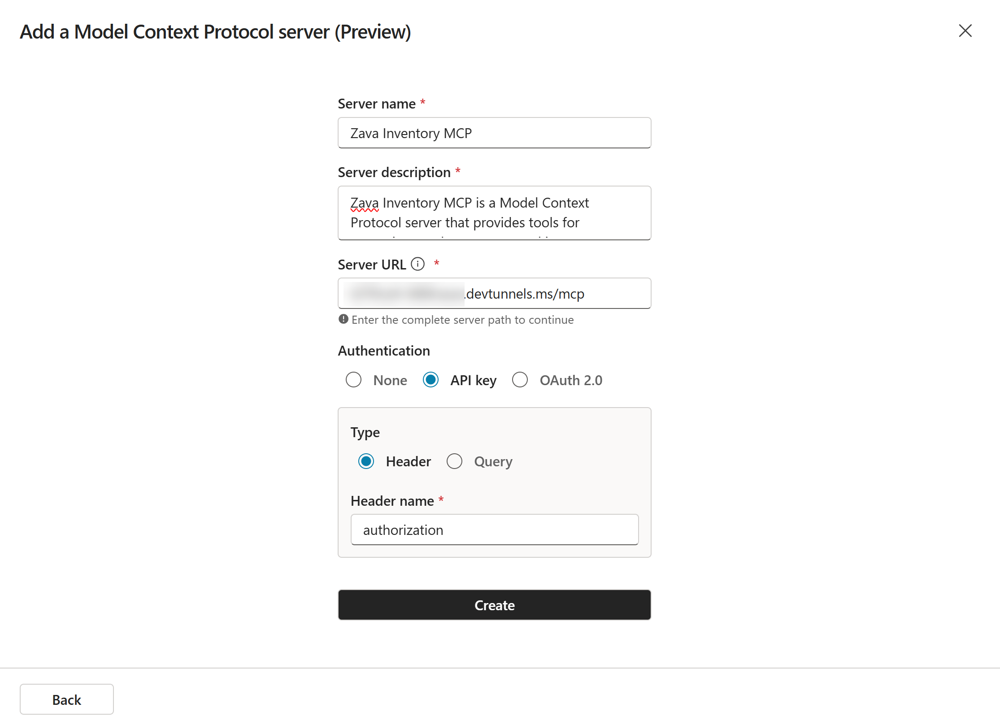

1. Check if all the values are correct and if so, select **Create** to add the MCP Server

    This will take a while, since in the background it is creating a custom connector for the MCP Server.

1. When it's done, select **Not connected** and **Create new connection**

    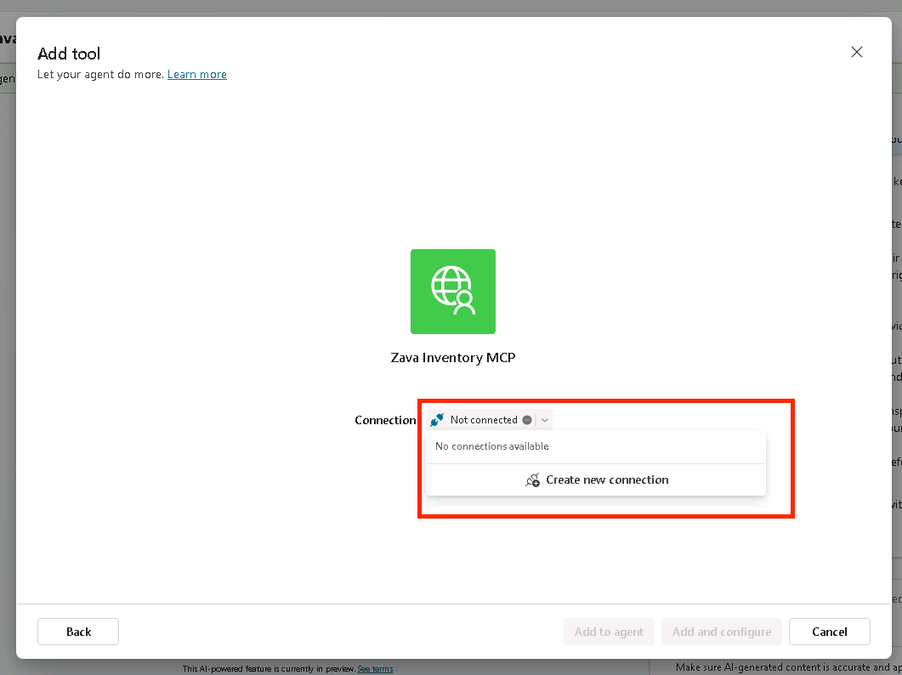

1. Enter the **API Key**:

      ```text
    SCS2025!
      ```

1. Select **Create**

    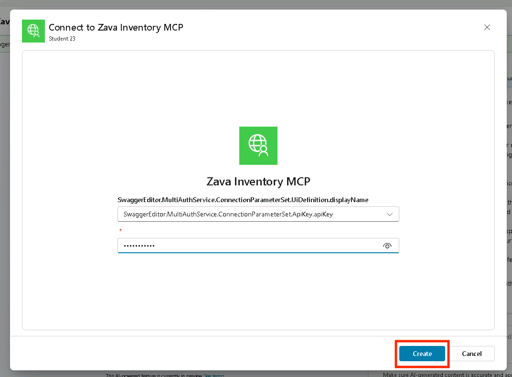

1. Select **Add to agent**

    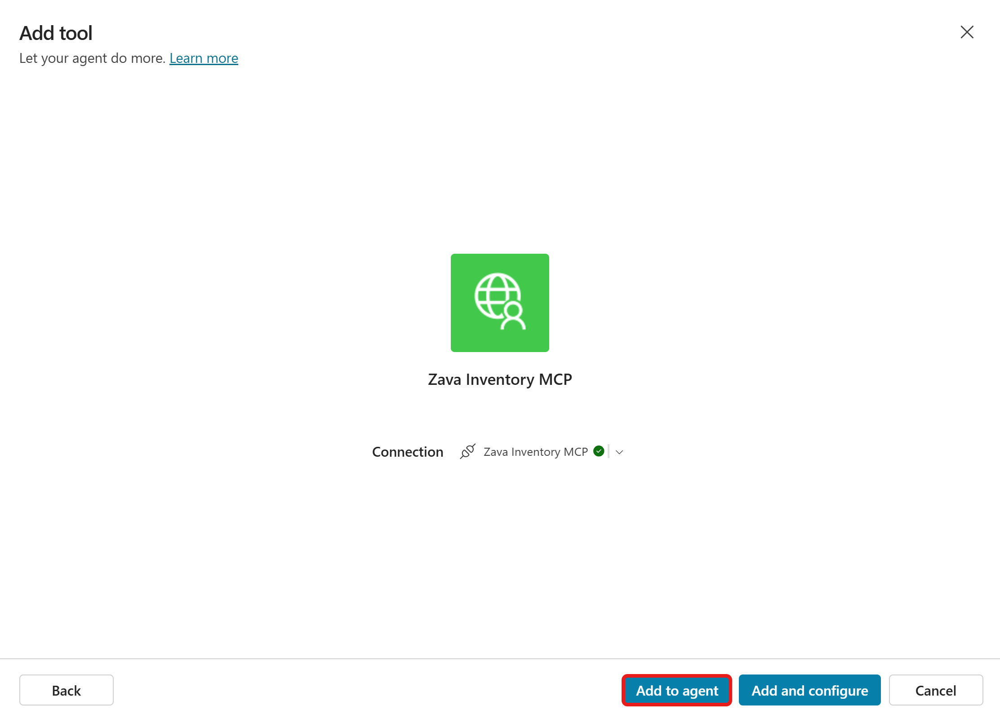

    Now it's time to test the agent with the MCP Server!

1. Select the **Map** icon in the top right corner of the *Test your agent* panel to activate the *Activity map*. This will help you understand what is happening when you are sending and receiving messages in the *Test your agent* panel.

    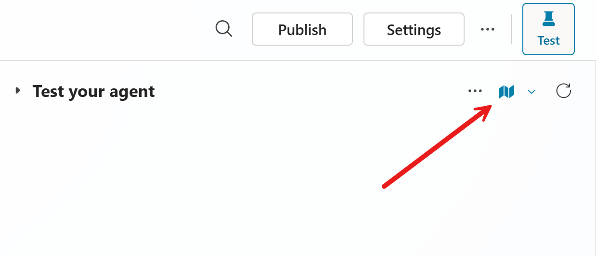

1. Now, enter the following message and send it in the *Test your agent* panel:

    ```text
    List the Zava Stores
    ```

    This should show you a whole bunch of Zava Stores as an answer in the *Test your agent* panel:

    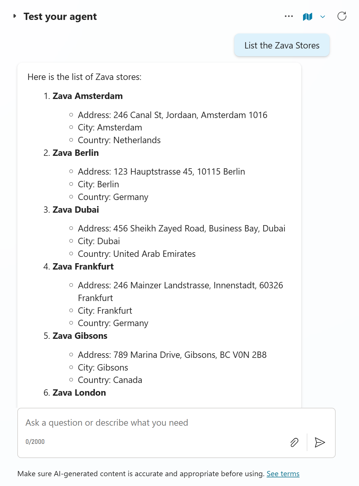

    And on the left in the *Activity map*, you can see that the Zava Inventory MCP has been initialized and the *get_stores* tool has been triggered by our message. When you click on the *get_stores* tool, you're even able to see the output that the agent got from the MCP server. This means our agent made that text into the formatted output we saw in the *Test your agent* panel.

    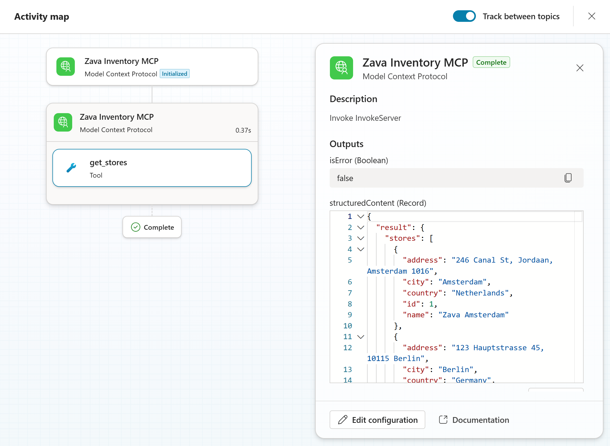

    Let's experiment a bit more with the other tools as well.

1. Send the following message to your agent via the *Test your agent* panel:

    ```text
    List the available products in the Zava Amsterdam store
    ```

    You will see the available products in the Zava Amsterdam store in the *Test your agent* panel:

    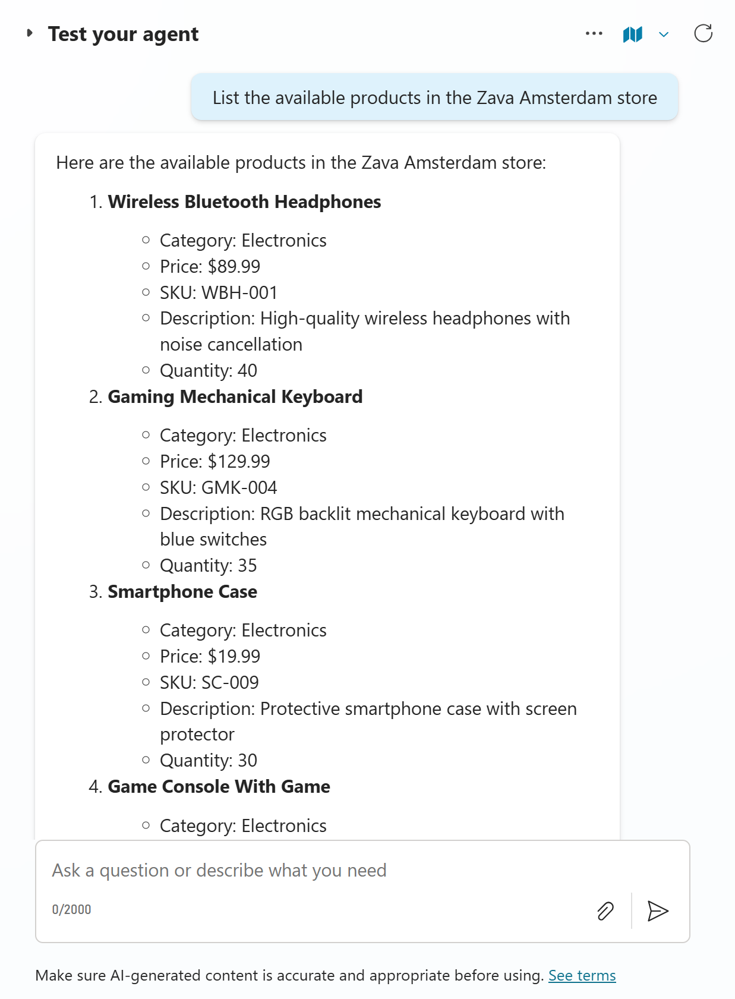

    Now you can see in the *Activity map* more tools have been triggered. The *get_stores* tool has been triggered again, because it needs it for the *list_inventory_by_store* tool. This really shows the power of MCP: when used correctly, it can do a lot of calls for you, without having to build a flow for it or to give it more instructions.

    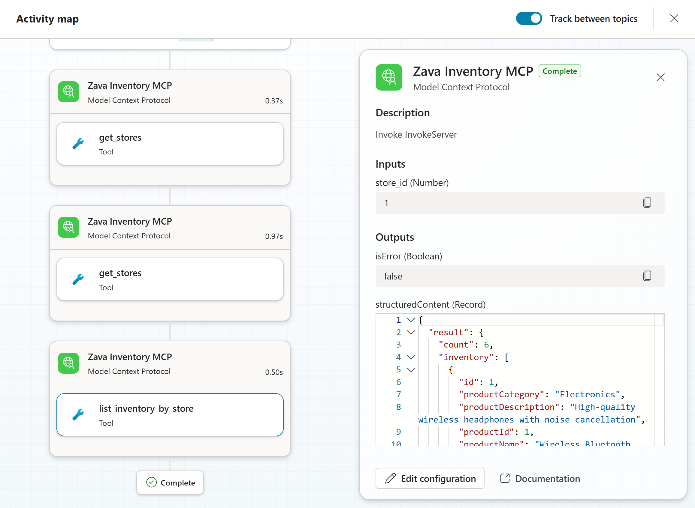

    But now - we only got information from the MCP Server, but wouldn't it be good to also add something?

1. Send the following message to your agent via the *Test your agent* panel:

    ```text
    Please add the following Zava Store:
    Zava Farnborough
    42 High Street, Farnborough, Hampshire, GU14 1BJ
    ```

    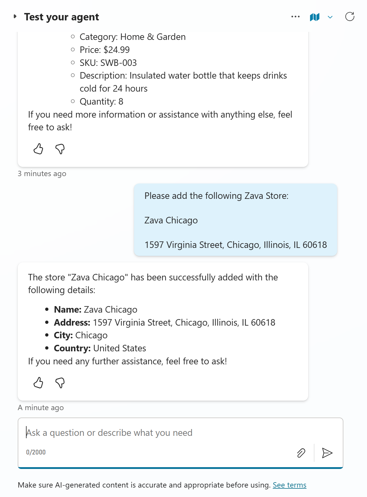

    As you can see, we didn't add United Kingdom to the message, but it automatically added that based on the details in the message.

    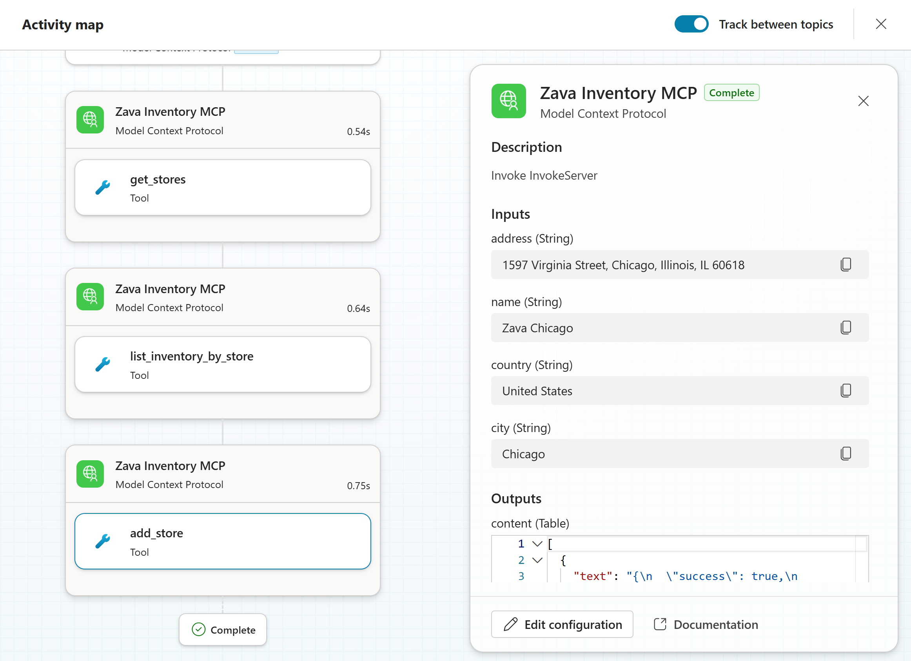

This section was to help you understand how to use MCP in a Copilot Studio agent. If you have time left at the end of this workshop, feel free to play around with the other tools in the MCP Server.

## More labs

If you're done early, you can try out one of the following workshops too:

- [Microsoft Copilot Studio ❤️ MCP](https://aka.ms/mcsmcp/lab)
- [Dataverse MCP Labs](https://aka.ms/dataverse/mcp/lab)
- [MCP for Beginners](https://aka.ms/mcp-for-beginners)
